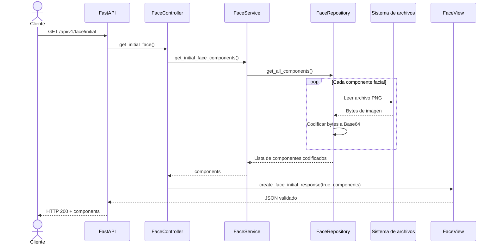
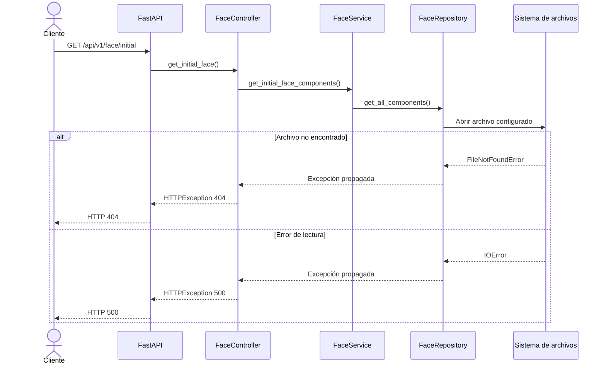
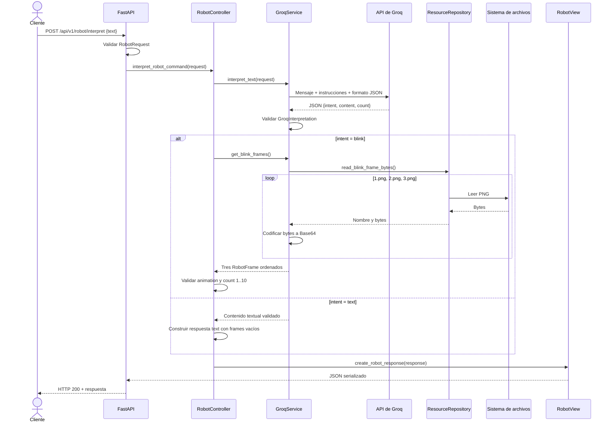
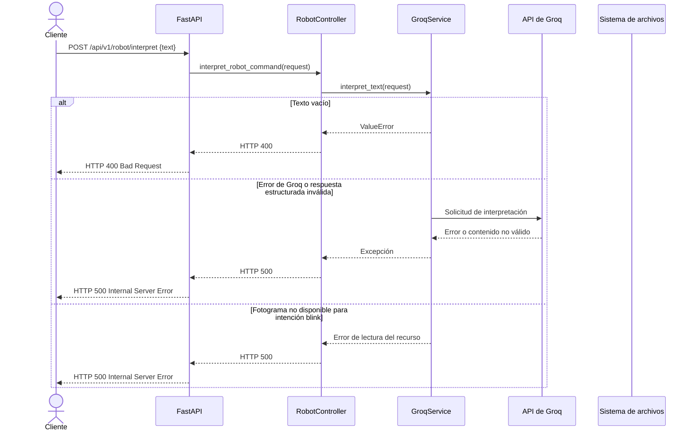

# Diagramas de flujo de los endpoints

## Secuencia: obtener el rostro inicial

```mermaid
sequenceDiagram
    actor Cliente
    participant API as FastAPI
    participant C as FaceController
    participant S as FaceService
    participant R as FaceRepository
    participant FS as Sistema de archivos
    participant V as FaceView

    Cliente->>API: GET /api/v1/face/initial
    API->>C: get_initial_face()
    C->>S: get_initial_face_components()
    S->>R: get_all_components()
    loop Cada componente facial
        R->>FS: Leer archivo PNG
        FS-->>R: Bytes de imagen
        R->>R: Codificar bytes a Base64
    end
    R-->>S: Lista de componentes codificados
    S-->>C: components
    C->>V: create_face_initial_response(true, components)
    V-->>API: JSON validado
    API-->>Cliente: HTTP 200 + components
```

### Errores del rostro inicial

```mermaid
sequenceDiagram
    actor Cliente
    participant API as FastAPI
    participant C as FaceController
    participant S as FaceService
    participant R as FaceRepository
    participant FS as Sistema de archivos

    Cliente->>API: GET /api/v1/face/initial
    API->>C: get_initial_face()
    C->>S: get_initial_face_components()
    S->>R: get_all_components()
    R->>FS: Abrir archivo configurado
    alt Archivo no encontrado
        FS-->>R: FileNotFoundError
        R-->>C: Excepción propagada
        C-->>API: HTTPException 404
        API-->>Cliente: HTTP 404
    else Error de lectura
        FS-->>R: IOError
        R-->>C: Excepción propagada
        C-->>API: HTTPException 500
        API-->>Cliente: HTTP 500
    end
```

## Secuencia: interpretar un texto

```mermaid
sequenceDiagram
    actor Cliente
    participant API as FastAPI
    participant C as RobotController
    participant G as GroqService
    participant Groq as API de Groq
    participant R as ResourceRepository
    participant FS as Sistema de archivos
    participant V as RobotView

    Cliente->>API: POST /api/v1/robot/interpret {text}
    API->>API: Validar RobotRequest
    API->>C: interpret_robot_command(request)
    C->>G: interpret_text(request)
    G->>Groq: Mensaje + instrucciones + formato JSON
    Groq-->>G: JSON {intent, content, count}
    G->>G: Validar GroqInterpretation
    alt intent = blink
        C->>G: get_blink_frames()
        G->>R: read_blink_frame_bytes()
        loop 1.png, 2.png, 3.png
            R->>FS: Leer PNG
            FS-->>R: Bytes
            R-->>G: Nombre y bytes
            G->>G: Codificar bytes a Base64
        end
        G-->>C: Tres RobotFrame ordenados
        C->>C: Validar animation y count 1..10
    else intent = text
        G-->>C: Contenido textual validado
        C->>C: Construir respuesta text con frames vacíos
    end
    C->>V: create_robot_response(response)
    V-->>API: JSON serializado
    API-->>Cliente: HTTP 200 + respuesta
```

### Errores de interpretación

```mermaid
sequenceDiagram
    actor Cliente
    participant API as FastAPI
    participant C as RobotController
    participant G as GroqService
    participant Groq as API de Groq
    participant FS as Sistema de archivos

    Cliente->>API: POST /api/v1/robot/interpret {text}
    API->>C: interpret_robot_command(request)
    C->>G: interpret_text(request)
    alt Texto vacío
        G-->>C: ValueError
        C-->>API: HTTP 400
        API-->>Cliente: HTTP 400 Bad Request
    else Error de Groq o respuesta estructurada inválida
        G->>Groq: Solicitud de interpretación
        Groq-->>G: Error o contenido no válido
        G-->>C: Excepción
        C-->>API: HTTP 500
        API-->>Cliente: HTTP 500 Internal Server Error
    else Fotograma no disponible para intención blink
        G-->>C: Error de lectura del recurso
        C-->>API: HTTP 500
        API-->>Cliente: HTTP 500 Internal Server Error
    end
```
